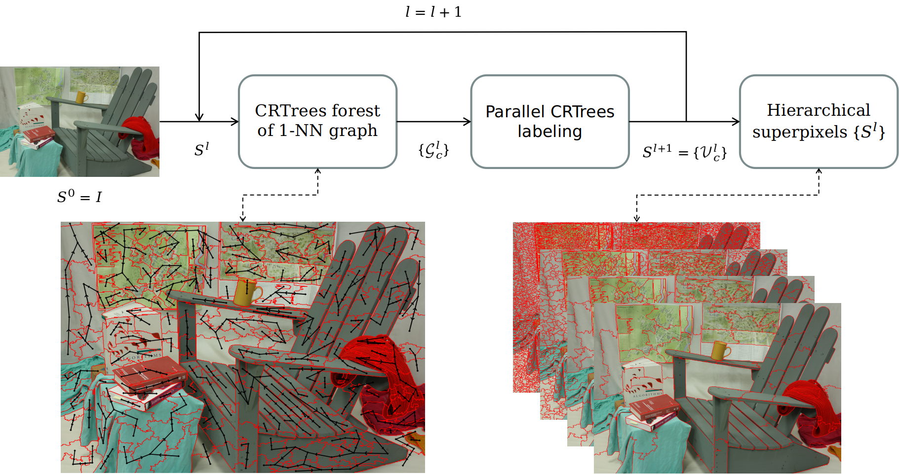

# Hierarchical Superpixel Segmentation by Parallel CRTrees Labeling
Please cite the [[paper](https://ieeexplore.ieee.org/document/9819438)] if you find it useful
```
@ARTICLE{9819438,
author={Yan, Tingman and Huang, Xiaolin and Zhao, Qunfei},
journal={IEEE Transactions on Image Processing},
title={Hierarchical Superpixel Segmentation by Parallel CRTrees Labeling},
year={2022},
volume={},
number={},
pages={1-1},
doi={10.1109/TIP.2022.3187563}}
```
# Workflow

# Dependency
- CUDA >= 6.0
- OpenCV >= 3.0
# Usage
Compile the code
```
unzip lib_eval.zip // this is for evaluation on datasets
bash build.sh
```
Test on a single image (the first run takes time to load the GPU)
```
bash run_img.sh
```
Video streams (a web camera is required)
```
bash run_video.sh
```
CRTREES can achieve 200+fps for 480P video streams on a Titan Xp GPU. Faster speed can be achieved if the GPU version of OpenCV is used.
## Benchmark
The superpixel benchmark (https://github.com/davidstutz/superpixel-benchmark) shall be put in the same level directory as this project.
```
bash bench_superpixels.sh BSDS500
```
## The same results as in the paper can be obtained.
